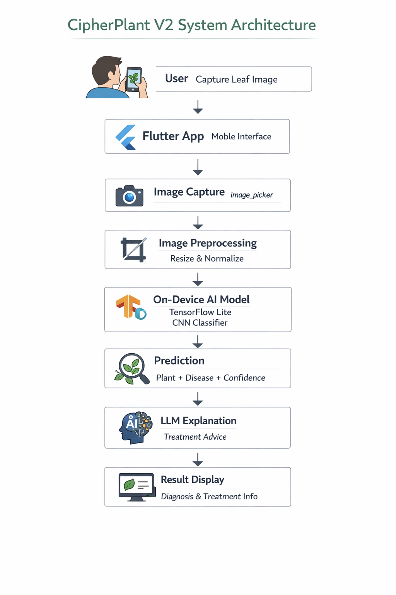
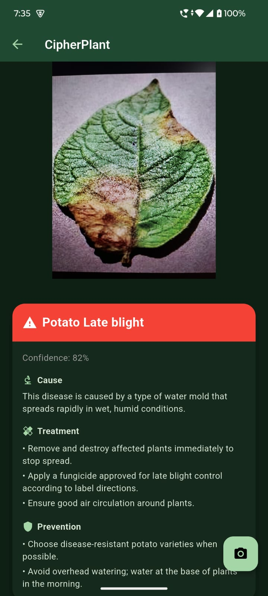
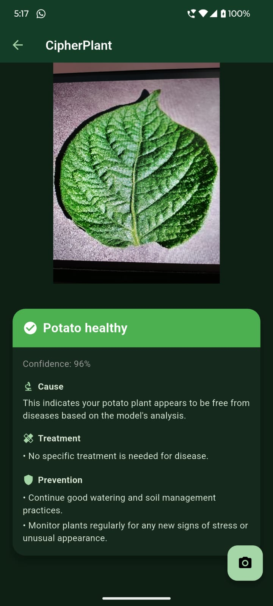

# 🌱 CipherPlant

**CipherPlant** is an AI-powered mobile application that detects plant diseases from leaf images and provides treatment recommendations.

The app uses **computer vision and on-device AI inference** to identify plant diseases directly on a smartphone, making diagnosis fast and accessible for farmers, gardeners, and plant enthusiasts.

---

# 🚀 Features

* 📷 Capture leaf images using the mobile camera
* 🧠 On-device plant disease detection using a deep learning model
* ⚡ Fast inference with TensorFlow Lite
* 🌿 Plant and disease classification
* 💡 AI-generated treatment suggestions
* 📱 Mobile-first experience built with Flutter

---

# 🧠 System Architecture

```
Camera
   ↓
Image Preprocessing
   ↓
TensorFlow Lite Model
   ↓
Plant + Disease Prediction
   ↓
LLM Explanation
   ↓
User Interface
```

---

# 🏗️ Tech Stack

### AI / Machine Learning

* TensorFlow
* TensorFlow Lite
* CNN-based plant disease classifier

### Mobile App

* Flutter
* Dart

### Flutter Libraries

```
image_picker
image
tflite_flutter
```

---

# 📂 Project Structure

```
cipherplant/
│
├── assets/
│   ├── models/
│   │   └── cipherplant.tflite
│   └── labels/
│       └── labels.txt
│
├── lib/
│   ├── components/
│   ├── pages/
│   ├── services/
│   │   └── inference_service.dart
│   └── main.dart
│
└── pubspec.yaml
```

---

# ⚙️ Installation

### 1️⃣ Clone the repository

```bash
git clone https://github.com/yourusername/cipherplant.git
cd cipherplant
```

---

### 2️⃣ Install dependencies

```
flutter pub get
```

---

### 3️⃣ Run the app

```
flutter run
```

Make sure a **physical Android device** or emulator is connected.

---

# 📷 How It Works



1. User captures a leaf image.
2. The image is preprocessed (resize + normalization).
3. The TensorFlow Lite model performs inference on-device.
4. The model predicts the **plant and disease class**.
5. An LLM generates a **human-readable explanation and treatment advice**.
6. Results are displayed in the app.

---

# 📊 Example Output

```
Plant: Tomato
Disease: Early Blight
Confidence: 91%

Treatment:
Remove infected leaves and apply copper-based fungicide.
Avoid overhead watering to reduce fungal spread.
```



---

# 🧪 Model Pipeline

```
Leaf Image
   ↓
Resize (224x224)
   ↓
Normalize (/255)
   ↓
CNN Model
   ↓
Prediction Vector
```

---

# 🔮 Future Improvements

* 🌍 Offline disease treatment database
* 🧠 Hybrid inference (on-device + API fallback)
* 📊 Confidence visualization
* 🪴 More plant species support
* 🤖 Advanced LLM-based plant care assistant

---

# 👨‍💻 Author

**Mohammad Asadullah**

AI Engineer focused on **computer vision, mobile AI, and intelligent applications**.

---

# ⭐ Project Goal

CipherPlant demonstrates how **deep learning models can be deployed directly on mobile devices**, enabling fast, accessible AI tools for real-world problems like plant disease detection.

---
